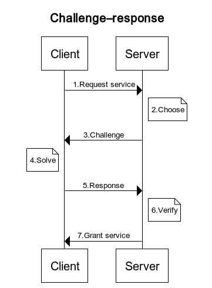

# Project requirements

#### Design and implement “Word of Wisdom” tcp server.

* TCP server should be protected from DDOS attacks with the [Proof of Work](https://en.wikipedia.org/wiki/Proof_of_work), 
the challenge-response protocol should be used.
* The choice of the POW algorithm should be explained.
* After Prof Of Work verification, server should send one of the quotes from “word of wisdom” book or any other collection of the quotes.
* Docker file should be provided both for the server and for the client that solves the POW challenge

#### Challenge–response protocol

Challenge–response protocols assume a direct interactive link between the requester (client) and the provider (server). 
The provider chooses a challenge, say an item in a set with a property, the requester finds the relevant response in the set, 
which is sent back and checked by the provider. 
As the challenge is chosen on the spot by the provider, its difficulty can be adapted to its current load. 
The work on the requester side may be bounded if the challenge-response protocol has a known solution (chosen by the provider), 
or is known to exist within a bounded search space.

#### Sequence (concept)

see [websequencediagrams](https://www.websequencediagrams.com)

```
title Challenge–response

Client->Server: 1.Request service
note right of Server: 2.Choose
Server->Client: 3.Challenge
note left of Client: 4.Solve
Client->Server: 5.Response
note right of Server: 6.Verify
Server->Client: 7.Grant service
```

